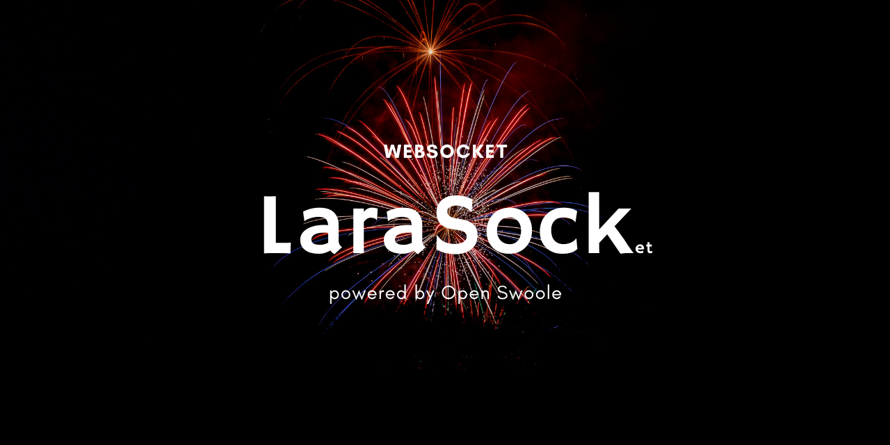

# LaraSock





> This is an early stage (under construction/exploration) work in progress, so currently, the project only implements some of the functionalities you expect. Feel free to share if you [want to contribute](CONTRIBUTING.md), providing Pull Request or
> suggestions. We believe in positive vibes.


## Why LaraSock?

Larasock implements a WebSocket Server based on Open Swoole.
The final goal is to support the same Application Providers supported by Laravel Octane (Swoole and Roadrunner).
This package lets you easily add real-time functionalities via WebSocket to your Laravel/Octane application.

So, if you are already using Open Swoole with your Laravel Octane,
you don't need additional services or external tools to enable the Web Socket functionalities.


## Installing LaraSock

The LaraSock `hi-folks/lara-sock` is provided as a PHP package that you can install in your Laravel project.
To install the package, you can use `composer require` command:

```bash
composer require hi-folks/lara-sock
```


## Starting the server

Installing the package in your Laravel project adds a new command with `php artisan`.
The new `larasock:start` artisan command starts a long live running process that starts a Web Socket server, ready to listen and accept your Web Socket connection from clients.

```bash
php artisan larasock:start
```

### Options

With the command, you can use some options:

```
--host[=HOST]     The IP address the server should bind to [default: "127.0.0.1"]
--port[=PORT]     The port the server should be available on [default: "9501"]
```
The default host is `127.0.0.1`, which means that
it can receive connections from localhost clients.
The default port is `9501`.

If you want to accept connections from all the clients on the network,
you have to "bind" to `0.0.0.0` IP address:

```shell
php artisan larasock:start --host=0.0.0.0
```

If you have Tmux installed, you can use it to start the Octane Web server and the WebSocket server on the same screen.
```shell
tmux \
    new-session  'php artisan octane:start' \; \
    split-window 'php artisan larasock:start --logchannel=stderr' \; \
    detach-client
tmux a
```
### The client
Once you start the Web Socket Server, you can create your Web client to send and receive messages.
You can implement your HTML page using the WebSocket Javascript class.

```html

<!doctype html>
<html>

<head>
    <title> WebSocket with PHP and Open Swoole </title>
    <link href="https://cdn.jsdelivr.net/npm/daisyui@2.50.0/dist/full.css" rel="stylesheet" type="text/css" />
    <script src="https://cdn.tailwindcss.com"></script>
    <script>
        let echo_service;
        append = function(text) {
            document.getElementById("websocket_events").insertAdjacentHTML('afterbegin',
                "<li class='border-solid border-y-2 border-indigo-400'>" + text + ";</li>"
            );
        }
        window.onload = function() {
            echo_service = new WebSocket('ws://127.0.0.1:9501');
            echo_service.onmessage = function(event) {
                console.log(event.data)
                append(event.data)
            }
            echo_service.onopen = function() {
                append("Connected to WebSocket!");
            }
            echo_service.onclose = function() {
                append("Connection closed");
            }
            echo_service.onerror = function() {
                append("Error happens");
            }
        }

        function sendMessage(event) {
            console.log(event)
            let message = document.getElementById("message").value;
            echo_service.send(message);
        }
    </script>
</head>

<body>
    <div class=" px-20 py-20" data-theme="acid">
        Message:
        <div class="form-control">
            <div class="input-group">
                <input id="message" value="Hello!" type="text" placeholder="Search…" class="input input-bordered" />
                <button class="btn btn-square" onclick="sendMessage(event)">
                    <svg xmlns="http://www.w3.org/2000/svg" class="h-6 w-6" fill="none" viewBox="0 0 24 24" stroke="currentColor">
                        <path stroke-linecap="round" stroke-linejoin="round" stroke-width="2" d="M21 21l-6-6m2-5a7 7 0 11-14 0 7 7 0 0114 0z" />
                    </svg>
                </button>
            </div>
        </div>
        <ul class="p-4" id="websocket_events">
        </ul>
    </div>
</body>

</html>
```
## A note about the Subprotocol

WebSocket defines a protocol that allows clients and servers to exchange data (messages).
A **Sub**-protocol defines the exchange message's structure and the meanings of each field. For example, you want to exchange a pure string with a text message without additional information. Or you want to exchange data with a more complex structure.

The current implementation of this Proof of Concept exchanges messages in string format.


## Next Step, the evolution of the Proof of Concept

This is just a Proof of Concept, the thing that I would like to focus on (and feel free to share any suggestion/feedback/pull request):

- Define the structure of the message
- Allow customising the broadcast method
- Rest API for showing statistics

The package is under construction, so if you have some suggestions, you can:
- [Write a Feature request](https://github.com/Hi-Folks/lara-sock/issues/new?labels=feature-request&title=%5BFeature+Request%5D%3A++)
- [Submit a Pull Request](https://github.com/Hi-Folks/lara-sock/pulls)
- [Write me on Twitter](https://twitter.com/RmeetsH)

## Contributing

Please see [CONTRIBUTING](CONTRIBUTING.md) for details.

### Submit ideas or feature requests, or issues

The package is under construction, so if you have some suggestions, you can:

* Take a look if your request is already there [https://github.com/Hi-Folks/lara-sock/issues](https://github.com/Hi-Folks/lara-sock/issues)
* If it is not present, you can create a new [feature request](https://github.com/Hi-Folks/lara-sock/issues/new?labels=feature-request&title=%5BFeature+Request%5D%3A++)
* [Submit a Pull Request](https://github.com/Hi-Folks/lara-sock/pulls)
* [Write me a message via Twitter](https://twitter.com/RmeetsH)

## Credits

- [Roberto Butti](https://github.com/roberto-butti)
- [All Contributors](https://github.com/Hi-Folks/lara-sock/graphs/contributors)

## Who talks about LaraSock
- [Teasing Tweet](https://twitter.com/RmeetsH/status/1625631431664836608)


## License

The MIT License (MIT). Please see [License File](LICENSE.md) for more information.